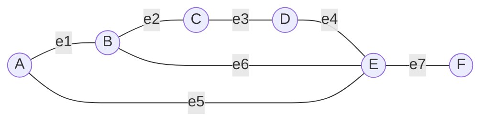

---
tags:
  - алгоритмы
  - графы
  - примеры
---

# Практический пример: Матрица инцидентности

**Матрица инцидентности** показывает связь между **вершинами** (строки) и **рёбрами** (столбцы). 

* **1** — вершина является концом (точкой привязки) данного ребра.
* **0** — вершина никак не связана с этим ребром.

---

## 📊 Граф с именованными рёбрами

Для построения матрицы мы дали каждому ребру своё имя (от `e1` до `e7`):

---

## 🧮 Построенная матрица инцидентности

Размер таблицы: **6 вершин × 7 рёбер**.

| Вершины / Рёбра | e1 | e2 | e3 | e4 | e5 | e6 | e7 |
| :--- | :---: | :---: | :---: | :---: | :---: | :---: | :---: |
| **A** | 1 | 0 | 0 | 0 | 1 | 0 | 0 |
| **B** | 1 | 1 | 0 | 0 | 0 | 1 | 0 |
| **C** | 0 | 1 | 1 | 0 | 0 | 0 | 0 |
| **D** | 0 | 0 | 1 | 1 | 0 | 0 | 0 |
| **E** | 0 | 0 | 0 | 1 | 1 | 1 | 1 |
| **F** | 0 | 0 | 0 | 0 | 0 | 0 | 1 |

---

## 🔍 Главные правила и свойства этой матрицы

1. **Строго две единицы в столбце:** Так как граф неориентированный и у каждого ребра ровно два конца, в абсолютно каждом столбце будет **ровно две единицы** (все остальные ячейки — нули).
2. **Степень вершины по строке:** Если сложить все единицы в любой строке, вы получите **степень вершины** (количество выходящих из неё дорог).
   * _Пример:_ В строке **E** целых четыре единицы (`e4, e5, e6, e7`), потому что это самый связный узел. В строке **F** — всего одна единица (`e7`).
3. **Форма таблицы:** В отличие от матрицы смежности, эта матрица **не квадратная** и **не симметричная**. Её размер напрямую зависит от количества рёбер в графе.

> [!💡] На заметку в будущем
> Если бы граф был **ориентированным** (со стрелочками), то вместо двух единиц в столбце мы бы ставили **1** туда, откуда стрелка выходит, и **-1** туда, куда она входит.
