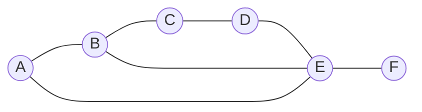

---
tags:
  - алгоритмы
  - графы
  - примеры
---

# Практический пример: Матрица смежности

**Матрица смежности** — это таблица, которая показывает, «кто с кем дружит» в графе. Строки и столбцы таблицы — это вершины. 

* **1** — вершины смежны (между ними есть ребро).
* **0** — вершины изолированы друг от друга.

---

## 📊 Исходный граф

---

## 🧮 Построенная матрица

| | A | B | C | D | E | F |
| :--- | :---: | :---: | :---: | :---: | :---: | :---: |
| **A** | 0 | 1 | 0 | 0 | 1 | 0 |
| **B** | 1 | 0 | 1 | 0 | 1 | 0 |
| **C** | 0 | 1 | 0 | 1 | 0 | 0 |
| **D** | 0 | 0 | 1 | 0 | 1 | 0 |
| **E** | 1 | 1 | 0 | 1 | 0 | 1 |
| **F** | 0 | 0 | 0 | 0 | 1 | 0 |

---

## 🔍 Разбор строк таблицы

* **Вершина `E`** — «душа компании». Она связана с четырьмя вершинами: `A`, `B`, `D` и `F`. В её строке больше всего единиц.
* **Вершина `F`** — «одиночка» (как кот программиста). Связана только с одной вершиной `E`. В её строке всего одна единица.
* **Вершина `A`** — смежна только вершинам `B` и `E`, поэтому в ячейках `[A][B]` и `[A][E]` стоят `1`, а в остальных `0`.

> [!📌] Важное свойство
> Так как перед нами **неориентированный** граф без петель, матрица получилась строго **симметричной относительно главной диагонали** (линии из нулей от верхнего левого угла до нижнего правого). Если `A` дружит с `B`, то и `B` автоматически дружит с `A`.
