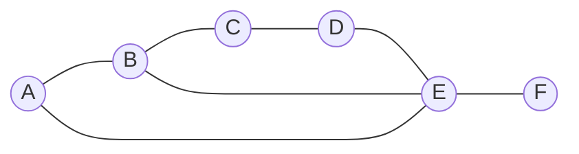

---
tags:
  - алгоритмы
  - графы
  - примеры
---

# Практический пример: Список смежности

**Список смежности** хранит граф в виде коллекции: `Вершина ➔ [Список её соседей]`. Если вершины ни с кем не связаны, список остаётся пустым. Это полностью избавляет нас от хранения лишних нулей.

---

## 📊 Исходный граф

Используем тот же самый граф для наглядности:



---

## 📝 Представление в виде списка

Каждому ключу (вершине) соответствует массив смежных узлов:

* **A** ➔ `[B, E]`
* **B** ➔ `[A, C, E]`
* **C** ➔ `[B, D]`
* **D** ➔ `[C, E]`
* **E** ➔ `[A, B, D, F]`
* **F** ➔ `[E]`

---

## 💻 Как это выглядит в коде? (На примере Python и JS)

В реальных алгоритмах такой список чаще всего реализуется через обычный словарь/объект (Dictionary / Map):

### Python (Словарь списков)
```python
graph = {
    'A': ['B', 'E'],
    'B': ['A', 'C', 'E'],
    'C': ['B', 'D'],
    'D': ['C', 'E'],
    'E': ['A', 'B', 'D', 'F'],
    'F': ['E']
}
```

### JavaScript (Объект с массивами)
```javascript
const graph = {
    A: ['B', 'E'],
    B: ['A', 'C', 'E'],
    C: ['B', 'D'],
    D: ['C', 'E'],
    E: ['A', 'B', 'D', 'F'],
    F: ['E']
}
```

---

## 🔍 Почему программисты любят этот способ?

1. **Супер-экономия памяти ($O(V + E)$):** Мы тратим память ровно на то количество вершин (`V`) и рёбер (`E`), которое у нас реально есть. Для графа из 10 000 городов, где из каждого выходит всего по 2-3 дороги, матрица смежности создала бы таблицу из 100 000 000 ячеек, а список смежности займет всего ~30 000 элементов.
2. **Удобный обход:** Чтобы узнать всех соседей вершины `E`, нам не нужно перебирать всю строку из нулей (как в матрице). Мы просто берём готовый массив `graph['E']` и сразу бежим по нему.

> [!⚠️] Минусы
> Если вам нужно моментально проверить, связаны ли две случайные вершины (например, `A` и `D`), придётся зайти в список для `A` и искать там элемент `D` перебором. В матрице смежности это проверялось за один шаг.
